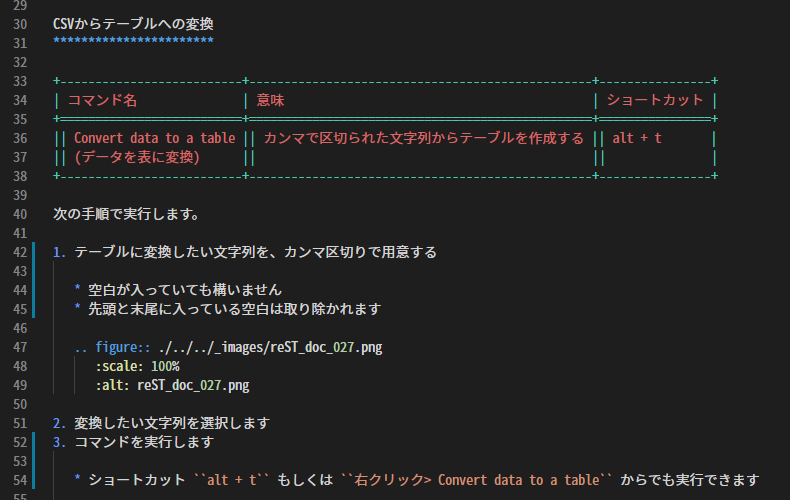

Grammer (highlighting of text)
##############################

This extension provides syntax highlighting for reStructuredText.

It will colorize inline markup, lists, tables, keywords, etc. appropriately.

.. note::
   If you have any requests for improvement, such as color coding not working properly, please report them via `Issues <https://github.com/TatsuyaNakamori/vscode-reStructuredText/issues>`_ .

