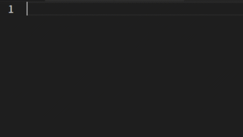
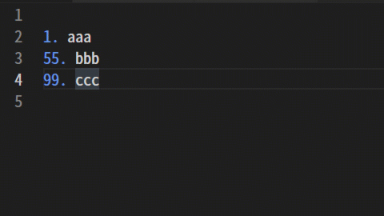

List
#####################

.. contents:: Table of contents for this page
   :depth: 3
   :local:

This page contains information on how to create and edit lists.

The following symbols are supported by this extension.
(You can still use other formats to build)

+--------+-------------------------------------------------------+
| Symbol | Meaning                                               |
+========+=======================================================+
| ``1.`` | Paragraph number (enter a number directly)            |
+--------+-------------------------------------------------------+
| ``#.`` | Paragraph number (replaced by a number at build time) |
+--------+-------------------------------------------------------+
| ``*``  | Itemization                                           |
+--------+-------------------------------------------------------+

-----------------

.. _CreatingList:

Creating a list
***************

In the editor, typing the following trigger characters will bring up suggestions for input assistance.
When you select an item, a symbol will be inserted at the beginning.

+-------------------------+
| Trigger Character       |
+=========================+
| ``.`` ``1`` ``#`` ``*`` |
+-------------------------+

.. figure:: ./../../_images/reST_doc_038.png
   :scale: 100%
   :alt: reST_doc_038.png

-----------------

Inserting the next line
********************************

Pressing the ``Enter`` button after finishing the first line will add a new entry to the next line ( ``Shift + Enter`` will add an entry to the line above).

In the case of the direct numeric input method ( ``1.`` ), the number will be inserted incremented to the next number.

-----------------

Nesting lists
**************

* You can nest the list by pressing the ``Tab`` button while the cursor is on a line of the list.

  * When you do so, a choice of symbols for the beginning of the list will appear, and you can select one of them.

* Pressing ``Shift + Tab`` on a line of the nested list will un-nest it.

.. figure:: ./../../_gifs/reST_list_nest.gif
   :alt: reST_list_nest.gif

-----------------

Rebuild the number
******************

* For lists with a direct numbering scheme ( ``1.`` ), the numbers are reconstructed when you add a new list line. (The numbers are sorted in order.)
* The first number is not rewritten, so it is possible to create a list from numbers other than 1.

.. note::
   In some formats, the numbers may not be reconstructed properly, so please rewrite them manually in that case.

-----------------

End of list
**************

Pressing the ``Enter`` button on a line where there are only symbols in the list will quit the list.

For example, after editing a line in a list, you can press the ``Enter`` button twice in a row to finish editing the list.

.. figure:: ./../../_gifs/reST_list_newParagraphs.gif
   :alt: reST_list_newParagraphs.gif

-----------------

.. note::
   If you cannot solve a problem, please report it to `Issues <https://github.com/TatsuyaNakamori/vscode-reStructuredText/issues>`_. Bugs and other reports are only accepted from this page.

