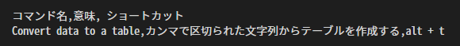
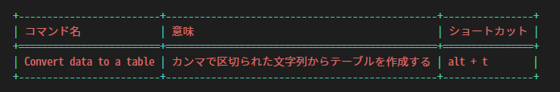

Table
###############

.. contents:: Table of contents for this page
   :depth: 2
   :local:

This page contains information on how to create and edit tables.

This extension supports grid tables.

  * Lines are separated by ``+----+----+``. (The header section is ``+====+====+``)
  * Columns are separated by ``|``.
  * Characters in a cell must have at least one space between them so that they are not adjacent to the ``|`` symbol in the column.

-----------------

Creating a table
****************

There are two ways to create a table.

Conversion from CSV
===================

Converts a comma-separated string to a table.

↓

.. seealso::
   See :ref:`CSV2TableConversion` for detailed usage.

.. _SpecifyRowsColumns:

Specify [rows] x [columns]
==========================

In the editor, typing ``[Rows]x[Columns]`` will give you suggestions for input assistance.

.. figure:: ./../../_images/reST_doc_035.png
   :scale: 75%
   :alt: reST_doc_035.png

+-------------------------------------------------------------+
| Trigger Character                                           |
+=============================================================+
| ``1`` ``2`` ``3`` ``4`` ``5`` ``6`` ``7`` ``8`` ``9`` ``0`` |
+-------------------------------------------------------------+

* When the trigger character is entered, the form of the string immediately before it must be ``[Rows]x[Columns]``.

  * Examples: ``4x9``, ``10x20``, etc.

* Header lines are not included in ``[Rows]``.

  * Selecting the ``(Table with header)`` entry will insert an additional row for the header.

| When you select one of the input aid candidates, an empty table will be created.
| (The top table is ``(Table with header)``, the bottom table is ``(Table without header)``. Both are ``2x3`` grids.)

.. figure:: ./../../_images/reST_doc_037.png
   :scale: 75%
   :alt: reST_doc_037.png

-----------------

Move/Reformat cell selections
********************************

| With the cursor in the table, you can move the cell selection by pressing the following key
| At the same time, it will also reformat (adjust the width of each cell).

+------------+-------------------+
| Actions    | Keys              |
+============+===================+
| Move down  | ``Enter``         |
+------------+-------------------+
| Move up    | ``Shift + Enter`` |
+------------+-------------------+
| Move right | ``Tab``           |
+------------+-------------------+
| Move left. | ``Shift + Tab``   |
+------------+-------------------+

-----------------

Line break in a cell
********************

To break a line in a cell, press ``Alt+Enter`` while the cell is selected.

-----------------

Add/delete matrices
*******************

Rows and columns can be added or deleted.

+---------------+----------------------------------------------------------------------------+
| Actions       | How to use                                                                 |
+===============+============================================================================+
| Add a line    | If the cursor is at the far right of the line, ``Enter``                   |
+---------------+----------------------------------------------------------------------------+
| Delete a line | Add ``-`` to the far right of the line and ``Enter``                       |
+---------------+----------------------------------------------------------------------------+
| Add a column  | Add ``+`` to the side of the cell separator ( ``|`` ) and press ``Enter``  |
+---------------+----------------------------------------------------------------------------+
| Delete column | Add ``-`` to the side of the cell separator ( ``|`` ) and press ``Enter``. |
+---------------+----------------------------------------------------------------------------+

-----------------

Moving Rows and Columns
***********************

You can move rows and columns up, down, left, or right.

+------------------------------+----------------------------------------------------------+
| Actions                      | How to use                                               |
+==============================+==========================================================+
|| Move up a line              || Add ``^`` to the side of the delimiter line (\ ``|``\ ) |
||                             || and press ``Enter``.                                    |
+------------------------------+----------------------------------------------------------+
|| Move down the line          || Add ``v`` to the side of the delimiter line (\ ``|``\ ) |
||                             || and press ``Enter``.                                    |
+------------------------------+----------------------------------------------------------+
|| Move column to the right    || Add ``>`` to the side of the delimiter line (\ ``|``\ ) |
||                             || and press ``Enter``.                                    |
+------------------------------+----------------------------------------------------------+
|| Move the column to the left || Add ``<`` to the side of the delimiter line (\ ``|``\ ) |
||                             || and press ``Enter``.                                    |
+------------------------------+----------------------------------------------------------+

If you type ``^`` ``v`` ``>`` ``<`` multiple times, you will move up by that amount.
For example, typing ``^^^`` and pressing ``Enter`` will move you up three lines.

-----------------

.. warning::
   * Currently, tables with merged cells are not supported (but can be built).
   * If the ``Enter`` or ``Tab`` key is pressed while the cursor is in a table, all cells will be reformatted to a split state.

   * If you want to edit a table with joined cells...

     1. With all cells split, edit the contents of the cells (leave the part to be merged blank)
     2. Manually merge cells after you are done editing
     3. When you have finished editing the cell join, bring the cursor outside the table

        * Do not press the ``Enter`` or ``Tab`` keys at this time.

.. note::
   If you cannot solve a problem, please report it to `Issues <https://github.com/TatsuyaNakamori/vscode-reStructuredText/issues>`_. Bugs and other reports are only accepted from this page.

