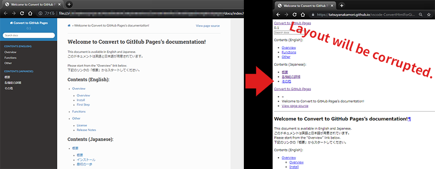
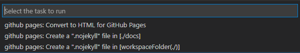

Create for GitHub Pages
##########################

Overview
********

Thinking of creating a page for GitHub Pages?

When you upload HTML created by Sphinx as GitHub Pages, you will face a problem that the CSS layout is broken.
A tool to solve this problem is available as `Convert to GitHub Pages`_.

Please download and use it.

Causes of layout collapse
*************************

Even if you build with Sphinx and display it locally without any problems, the layout will be broken when you upload it directly to GitHub Pages.

There are two reasons why the layout is broken.

1. GitHub Pages uses `jekyll <http://jekyllrb-ja.github.io/>`_ for hosting by default, so it doesn't accurately read paths that are not supported by jekyll
2. The path to CSS and other files is different between the server and local, and the URL on the GitHub Pages server needs to be specified.

Solutions
*********

You can solve this problem by setting the following

1. Put an empty file ``.nojekyll`` directly under the folder where you publish your GithHub Pages to stop hosting jekyll.
2. Convert relative paths to CSS files in HTML to GitHub Pages URLs using ``<base>`` tags.

Function
********

There is a function to create a ``.nojekyll`` file and a function to insert a ``<base>`` tag in the ``<head>`` of HTML, each of which can be executed from Task.

.. seealso::
   For more information, see the `Document`_ on "Convert to GitHub Pages".

Points to note when creating HTML with Sphinx
*********************************************

There are no special precautions. Just create it as usual.

There is a ``githubpages extension`` to Sphinx, but you don't need to use it.

"Convert to GitHub Pages" will copy the HTML files exported to ``build/html`` to the ``docs`` folder (or ``Root`` ), and insert ``<base>`` tags.

Links
*******

* `Convert to GitHub Pages`_ (Marketplace)
* `Document`_

.. _Convert to GitHub Pages: https://marketplace.visualstudio.com/items?itemName=TatsuyaNakamori.htmlgithubpages
.. _Document: https://tatsuyanakamori.github.io/vscode-ConvertHtmlForGithubPages/

