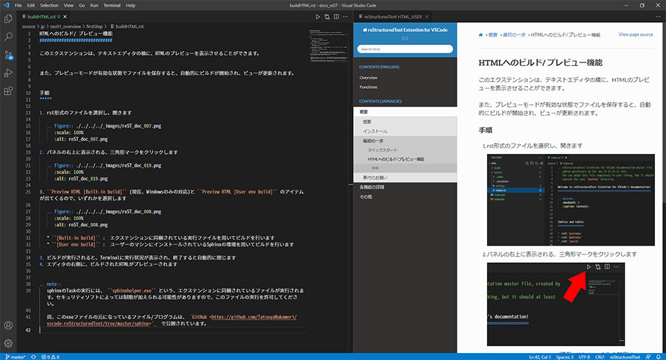

HTMLへのビルド/ プレビュー機能
##############################

このエクステンションは、テキストエディタの横に、HTMLのプレビューを表示させることができます。
また、プレビューモードが有効な状態でファイルを保存すると、自動的にビルドが開始され、ビューが更新されます。

手順
*****

1. rst形式のファイルを選択し、開きます

   .. figure:: ./../../../_images/reST_doc_007.png
      :scale: 100%
      :alt: reST_doc_007.png

2. パネルの右上に表示される、三角形マークをクリックします

   .. figure:: ./../../../_images/reST_doc_019.png
      :scale: 100%
      :alt: reST_doc_019.png

3. ``Preview HTML [Built-in build]`` (現在、Windowsのみの対応)と ``Preview HTML [User env build]`` のアイテムが出てくるので、いずれかを選択します

   .. figure:: ./../../../_images/reST_doc_008.png
      :scale: 100%
      :alt: reST_doc_008.png

   * ``[Built-in build]`` :  エクステンションに同梱されている実行ファイルを用いてビルドを行います
   * ``[User env build]`` :  ユーザーのマシンにインストールされているSphinxの環境を用いてビルドを行います

     .. seealso::
        詳細は :ref:`ビルド` を参照してください

3. ビルドが実行されると、Terminalに実行状況が表示され、終了すると自動的に閉じます
4. エディタの右側に、ビルドされたHTMLがプレビューされます

自動更新
********

1. rstファイルの内容を変更し、保存します

   * 自動的にビルドが始まり、プレビュー画面が更新されます

2. ビルドやプレビューを終了する時は、プレビュー画面のパネルを閉じてください

----

.. note::
   ``Preview HTML [Built-in build]`` の実行には、 ``sphinxhelper.exe`` という、エクステンションに同梱されているファイルが実行されます。セキュリティソフトによっては制限が加えられる可能性がありますので、このファイルの実行を許可してください。

   尚、このexeファイルの元になっているファイル/プログラムは、 `GitHub <https://github.com/TatsuyaNakamori/vscode-reStructuredText/tree/master/sphinx>`_  で公開されています。

.. seealso::
   下記リンク先には、将来的に改善される可能性がある項目がまとめられています。

   :ref:`既知の問題> HTML Preview <既知の問題htmlPreview>`

