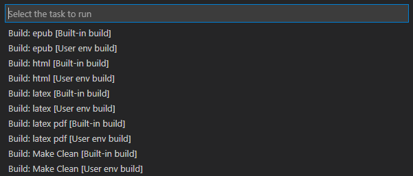

.. _ビルド:

ビルド
###############

ビルド機能を使うと、これまでコマンドプロントを立ち上げて行っていたビルド処理をVSCodeから行うことができます。

タスクの種類
************

* 各タスクは、 ``[User env build]`` と ``[Built-in build]`` が用意されています。
* ``[Built-in build]`` は、現状Windowsのみの対応です。

+------------+------------------------------------------------------+
| Task       | 説明                                                 |
+============+======================================================+
| epub       | epubへ変換                                           |
+------------+------------------------------------------------------+
| html       | HTMLへ変換                                           |
+------------+------------------------------------------------------+
| latex      | latexへ変換                                          |
+------------+------------------------------------------------------+
| latex pdf  | PDFへ変換                                            |
+------------+------------------------------------------------------+
| Make Clean | buildフォルダのリセット(フォルダ内コンテンツの削除)) |
+------------+------------------------------------------------------+

[User env build]
****************

ユーザーのマシンの環境を利用してビルドを行います。
ご自身で環境を整えている方は、こちらのオプションを利用することを推奨します。

このオプションの項目を選択すると、PowerShellで ``./make XXX`` のコマンドが実行されます。

  * ``./make XXX`` の ``XXX`` の部分には、 ``html`` ``epub`` ``latex`` ``latexpdf`` ``clean`` のいずれかが入ります
  * カレントディレクトリ(ワークディレクトリ)は、VSCodeのワークスペースフォルダになります

各種環境パスが適切に通っていることが必要です。
エラーが起こった場合は、Terminalのメッセージを確認してください。

[Built-in build]
****************

.. note::
   もし、トラブルが解決できない場合は、 `Issues <https://github.com/TatsuyaNakamori/vscode-reStructuredText/issues>`_ に報告してください。
   バグなどの報告はこのページからのみ受け付けています。

