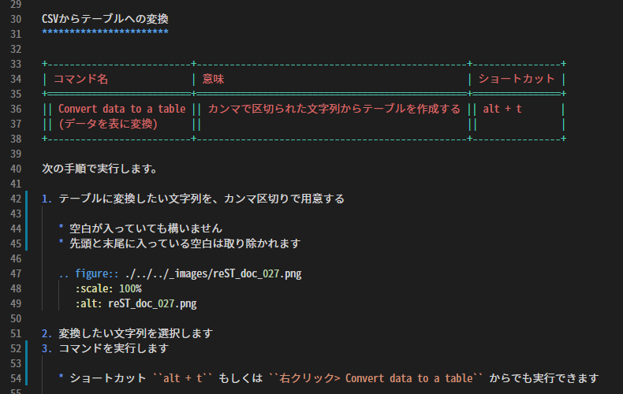

文字のハイライト表示
###############################

このエクステンションでは、reStructuredText用のシンタックスハイライト表示の機能があります。

インラインマークアップやリスト、テーブル、キーワードなどを適切に色分けします。

.. note::
   上手く色分けされないなどの改善要望がある場合は、`Issues <https://github.com/TatsuyaNakamori/vscode-reStructuredText/issues>`_ から報告してください。

