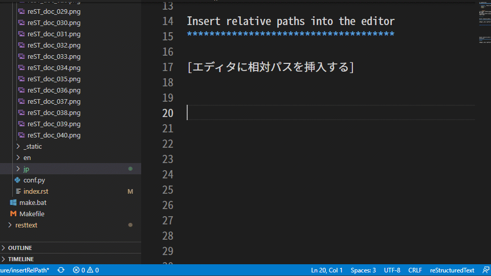

相対パスの挿入
#######################

.. contents:: このページの目次
   :depth: 2
   :local:

``.. figure::``,  ``.. image::``, ``.. toctree::`` などのディレクティブでは、ファイルを相対パスで指定します。
そのパスを記述する手間を省くためのツールが用意されています。

--------

Insert relative paths into the editor
*************************************

[エディタに相対パスを挿入する]

* 画像などのファイルへの相対パスを挿入します。
* エディタで開いている、 ``ファイルと同じ階層(フォルダ)`` から ``指定したファイル`` への相対パスになります。(reStructuredTextやHTMLで使用される相対パスの指定の仕方になります)
* パスの区切り文字はスラッシュになります。

結果は次のようになります。

+--------------------------+----------------------------+
| 開いているファイル(From) | C:/path/to/html/index.html |
+--------------------------+----------------------------+
| To                       | C:/path/to/css/default.css |
+--------------------------+----------------------------+
| 結果                     | ../css/default.css         |
+--------------------------+----------------------------+

使い方

1. パスを挿入するファイルをエディタで開き、挿入する位置へカーソルを移動します
2. エクスプローラーを開き、画像などのファイル名の上で右クリックし、 ``Insert relative paths into the editor`` を選択します

   * 左クリックしてしまうと画像データがエディタで開いてしまうので注意してください

   .. figure:: ../../_images/reST_doc_041.png
      :scale: 85%
      :alt: reST_doc_041.png

3. 相対パスが挿入されます

-----

Insert relative paths into the editor (without extension)
*********************************************************

[エディタに相対パスを挿入する (拡張子なし)]

* 拡張子を除いた相対パスを挿入します。(``.. toctree::`` のように、拡張子を必要としない時に使用します)
* エディタで開いている、 ``ファイルと同じ階層(フォルダ)`` から ``指定したファイル`` への相対パスになります。(reStructuredTextやHTMLで使用される相対パスの指定の仕方になります)
* パスの区切り文字はスラッシュになります。

結果は次のようになります。

+--------------------------+-------------------------------------+
| 開いているファイル(From) | C:/path/to/reST/index.rst           |
+--------------------------+-------------------------------------+
| To                       | C:/path/to/reST/section01/index.rst |
+--------------------------+-------------------------------------+
| 結果                     | section01/index                     |
+--------------------------+-------------------------------------+

使い方

1. パスを挿入するファイルをエディタで開き、挿入する位置へカーソルを移動します
2. エクスプローラーを開き、画像などのファイル名の上で右クリックし、 ``Insert relative paths into the editor (without extension)`` を選択します

   * 左クリックしてしまうと画像データがエディタで開いてしまうので注意してください

   .. figure:: ../../_images/reST_doc_042.png
      :scale: 85%
      :alt: reST_doc_042.png

3. 相対パスが挿入されます

-----

.. note::
   何か問題があった場合は、`Issues <https://github.com/TatsuyaNakamori/vscode-reStructuredText/issues>`_ から報告してください。

