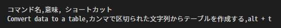
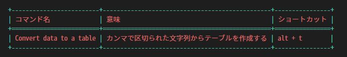
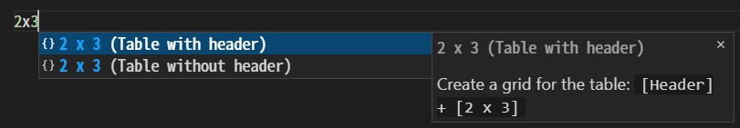
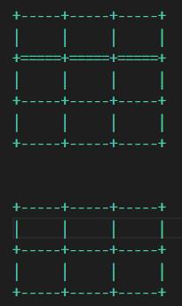

テーブルの機能
###############

.. contents::
   :depth: 3

テーブルの作成方法、編集方法をまとめたページです。

このエクステンションは、グリッドテーブルをサポートしています。

  * 行は ``+----+----+`` で区切ります (ヘッダー部分は ``+====+====+`` )
  * 列は ``|`` で区切ります
  * セル内の文字は、列の ``|`` 記号と接しないように、最低1つの半角空白が必要です

-----------------

テーブルの作成
**************

テーブルの作成方法は2つあります。

CSV からの変換
==================

カンマで区切られた文字列をテーブルに変換します。

↓

.. seealso::
   詳しい使い方は、 :ref:`CSVからテーブルへの変換` を参照してください。

.. _行数x列数指定:

[行数]x[列数] 指定
==================

エディタで、 ``[行数]x[列数]`` という形で入力すると、入力補助の候補が出てきます。

+-------------------------------------------------------------+
| トリガー 文字                                               |
+=============================================================+
| ``1`` ``2`` ``3`` ``4`` ``5`` ``6`` ``7`` ``8`` ``9`` ``0`` |
+-------------------------------------------------------------+

* トリガー文字が入力されたときに、その直前の文字列の形が、 ``[行数]x[列数]`` になっていることが必要です。

  * 例: ``4x9`` , ``10x20`` など

* ヘッダー部分の行は ``[行数]`` に入れません

  * 入力補助の ``(Table with header)`` の項目を選択すると、ヘッダー部分の行を追加で挿入します

| 入力補助候補のいずれかを選択すると、空のテーブルが作成されます。
| ([下図] 上が ``(Table with header)`` ,  下が ``(Table without header)`` のテーブル。いずれも ``2x3`` のグリッド)

-----------------

セルの選択の移動/ リフォーマット
********************************

| テーブルにカーソルがある状態で、次のキーを押すことで、セルの選択の移動が可能です。
| また、同時にリフォーマット(各セルの横幅の調整)を行います。

+------------+-------------------+
| アクション | キー              |
+============+===================+
| 下に移動   | ``Enter``         |
+------------+-------------------+
| 上に移動   | ``Shift + Enter`` |
+------------+-------------------+
| 右に移動   | ``Tab``           |
+------------+-------------------+
| 左に移動   | ``Shift + Tab``   |
+------------+-------------------+

-----------------

セル内での改行
**************

セル内で改行するには、セルを選択している状態で ``Alt + Enter`` キーを押します。

-----------------

行列の追加/ 削除
****************

行と列を追加したり、削除することができます。

+------------+---------------------------------------------------------+
| アクション | 方法                                                    |
+============+=========================================================+
| 行を追加   | 行の一番右端にカーソルがある状態で ``Enter``            |
+------------+---------------------------------------------------------+
| 行を削除   | 行の一番右端に ``-`` を追記し、 ``Enter``               |
+------------+---------------------------------------------------------+
| 列を追加   | セルの区切り線( ``|`` )の側に ``+`` を追記し、``Enter`` |
+------------+---------------------------------------------------------+
| 列を削除   | セルの区切り線( ``|`` )の側に ``-`` を追記し、``Enter`` |
+------------+---------------------------------------------------------+

-----------------

行列の移動
**********

行と列を上下左右に移動できます。

+--------------+---------------------------------------------------------+
| アクション   | 方法                                                    |
+==============+=========================================================+
| 行を上に移動 | セルの区切り線( ``|`` )の側に ``^`` を追記し、``Enter`` |
+--------------+---------------------------------------------------------+
| 行を下に移動 | セルの区切り線( ``|`` )の側に ``v`` を追記し、``Enter`` |
+--------------+---------------------------------------------------------+
| 列を右に移動 | セルの区切り線( ``|`` )の側に ``>`` を追記し、``Enter`` |
+--------------+---------------------------------------------------------+
| 列を左に移動 | セルの区切り線( ``|`` )の側に ``<`` を追記し、``Enter`` |
+--------------+---------------------------------------------------------+

``^`` ``v`` ``>`` ``<`` を複数回入力すると、その分移動します。
例えば、 ``^^^`` と入力して ``Enter`` キーを押すと、3行分上に移動します。

-----------------

.. warning::
   * 現状、セルが結合されているテーブルには対応していません(ビルドはできます)
   * テーブルにカーソルがある状態で ``Enter`` や ``Tab`` キーなどが押されると、全てのセルが分割された状態にリフォーマットされてしまいます

   * 結合したセルを持つテーブルを編集したい場合...

     1. 全てのセルが分割された状態で、セルの中身を編集します(結合する部分は空白にしておきます)
     2. 編集が終わった後に、手動でセルを結合します
     3. セルの結合の編集が終わったら、カーソルをテーブルの外に持っていきます

        * この時、 ``Enter`` や ``Tab`` キーなどを押さないようにしてください

.. note::
   もし、トラブルが解決できない場合は、 `Issues <https://github.com/TatsuyaNakamori/vscode-reStructuredText/issues>`_ に報告してください。バグなどの報告はこのページからのみ受け付けています。

